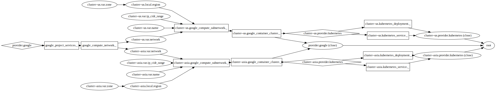

# Terraforming GKE and Kubernetes

This is my demo of some sharp edges when using the kubernetes provider alongside
the google provider. In this example, I make a global network and two Kubernetes
(k8s) clusters, both of which run a hello-world http server. My aim is to
increase awareness about these issues with the core devs, and perhaps get some
of these sharp edges hammered flat.

Please leave issues on this repo if you want to start a discussion about
workarounds or my proposed changes to terraform. I'm particularly interested
about what bits of the internals, in particular, would need to be changed.

I'd love to (attempt to) contribute these changes, but the earliest that could
even possibly happen is (perhaps) 2019-07-01.



## My setup

```
$ tf version
Terraform v0.11.11
+ provider.google v1.20.0
+ provider.kubernetes v1.4.0

$ alias tf=terraform
```

## Things that work

1.  The infrastructure spins up just fine.

```
$ tf apply

An execution plan has been generated and is shown below.
Resource actions are indicated with the following symbols:
  + create

Terraform will perform the following actions:

  + google_compute_network._
      id:                                                            <computed>
      auto_create_subnetworks:                                       "false"
      gateway_ipv4:                                                  <computed>
      name:                                                          "worldwide"
<<snip>>
Plan: 10 to add, 0 to change, 0 to destroy.

Do you want to perform these actions?
  Terraform will perform the actions described above.
  Only 'yes' will be accepted to approve.

  Enter a value: yes
<<snip>>
module.cluster--asia.kubernetes_deployment._: Still creating... (1m0s elapsed)
module.cluster--us.kubernetes_service._: Still creating... (50s elapsed)
module.cluster--asia.kubernetes_deployment._: Creation complete after 1m8s (ID: default/hello-node)
module.cluster--us.kubernetes_service._: Creation complete after 56s (ID: default/hello-node-service)

Apply complete! Resources: 10 added, 0 changed, 0 destroyed.
```

## Mostly Works

### Changing Parameters

If I change the zone of one of the clusters, terraform gets to the intended
state after two runs, but I suspect this is mostly coincidental.

On the first run it tears down the GKE cluster but none of its k8s contents,
which makes it seem like the provider is being treated as a special case in the
dependency graph when it shouldn't. The first run does successfully bring up the
new cluster, but none of its k8s contents. On the second run, it notices that
the k8s contesnts are missing and successfully provisions them.

Note that the original k8s resources were never deprovisioned. This would lead
to strange Bad Things if there were any state that persisted from a k8s resource
after a GKE cluster is deleted from underneath it. Thankfully (but not helpful
for my example) in this case the GKE cluster deprovisioned all its contents
before going away.

Keep in mind, however, this edge-case will apply to *any* dependent provider
whose module's parameters change. GKE and k8s are incidental here, and I feel
sure that in the broader world there will exist a case where this slight
incorrectness will be quite damaging.

### Teardown

```
$ tf plan -destroy -out destroy.plan
$ tf apply destroy.plan
module.cluster--us.kubernetes_deployment._: Destroying... (ID: default/hello-node)
module.cluster--us.kubernetes_service._: Destroying... (ID: default/hello-node-service)
module.cluster--asia.kubernetes_service._: Destroying... (ID: default/hello-node-service)
module.cluster--asia.kubernetes_deployment._: Destroying... (ID: default/hello-node)
<<snip>>
module.cluster--asia.google_compute_subnetwork._: Still destroying... (ID: asia-east1/asia, 10s elapsed)
module.cluster--asia.google_compute_subnetwork._: Destruction complete after 18s
module.cluster--us.google_compute_subnetwork._: Still destroying... (ID: us-central1/us, 10s elapsed)
module.cluster--us.google_compute_subnetwork._: Destruction complete after 18s
google_compute_network._: Destroying... (ID: worldwide)
google_compute_network._: Still destroying... (ID: worldwide, 10s elapsed)

Error: Error applying plan:

1 error(s) occurred:

* google_compute_network._ (destroy): 1 error(s) occurred:

* google_compute_network._: The network resource 'projects/bukzor-demo-depprov-bug/global/networks/worldwide' is already being used by 'projects/bukzor-demo-depprov-bug/global/firewalls/k8s-676184843ca384df-node-http-hc'


Terraform does not automatically rollback in the face of errors.
Instead, your Terraform state file has been partially updated with
any resources that successfully completed. Please address the error
above and apply again to incrementally change your infrastructure.

```

What happened here is that some of the firewall rules created by the kubernetes
resources were not cleaned up, which prevented the network from being deleted.
I've no idea whose bug this is: Google Cloud, Kubernetes, Terraform,
kubernetes-provider. Any of those four could have caused it.

My hunch is that this is related to the above micro-bug; since the kubernetes
provider doesn't participate in the resource graph, I would bet that the GKE
cluster was torn down *in parallel* with the kubernetes resources, resulting in
some of the k8s objects not being (completely) destroyed before the cluster
teardown obliterated them, leaving behind these orphaned firewall rules.

## Doesn't Work at All

### Importing Dependent-Provider Resources

The error indicates this is a known issue:

```
$ tf import module.cluster--us.kubernetes_deployment._ hello-node-service

Error: Provider "kubernetes" depends on non-var "google_container_cluster._.0/google_container_cluster._.N". Providers for import can currently
only depend on variables or must be hardcoded. You can stop import
from loading configurations by specifying `-config=""`.

```

I'm sure there's some legacy reason this is hard to fix, but why isn't it as
simple as using whatever `tf plan` uses? *It* doesn't have any problem reasoning
about this resource, so it must have configured the kubernetes provider before
starting its work.

A workaround is to delete the contents of the `provider "kubernetes"` block,
then setup up kubectl out-of-band to connect to the *correct* k8s cluster. Then
the provider has static values (nothing) that point to your cluster. Apparently
the k8s provider deafults to using whagtever kubectl wants? That seems like a
disaster waiting to happen, but it's helpful in this case.

### Renaming or Deleting a Dependent Provider's Module

If you comment out, rename, delete either of the `module "clusters"` blocks in
the root main.tf, terraform freaks out:

```
$ vim main.tf  # comment out the cluster--us resource
$ tf apply

Error: Error asking for user input: 1 error(s) occurred:

* module.cluster--us.kubernetes_service._: configuration for module.cluster--us.provider.kubernetes is not present; a provider configuration block is required for all operations

```

This (and renaming/deleting) is a fairly common and idiomatic thing to do with
terraform resources, especially during prototyping, so this is a major headache
to me and my team.

I see that the parameters I use to build my kubernetes provider are in the state
file. If terraform put some amount of knowlege about the provider in its state
file, this would be a non-issue. If providers were treated like any other
resource, this bug would go away (as well as the sortof bug, above, when
changing parameters).

The only argument against this, that I can think of, is the sensitivity of some
parameters to providers; often there's a password or some other secret. This
could be solved (if it's even a real concern) by only storing a *reference* to
any non-static arguments. Then if the referenced data is in the tfstate graph,
it can be found and used. If there was a secret passed in via a prompt, it can't
be found this way and should use the usual `tf apply` config prompting behavior.
